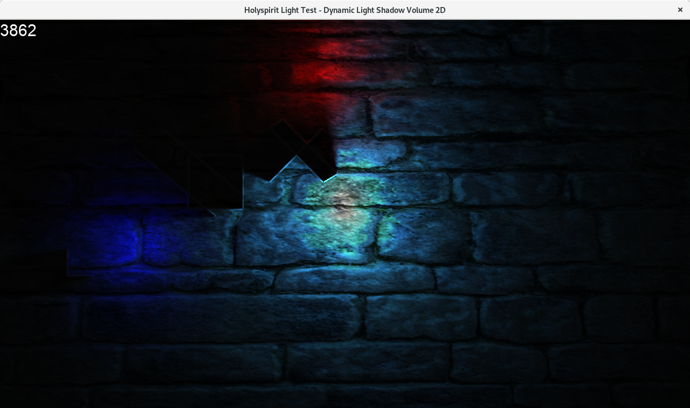

# [2013-2019] 2D Soft Shadow



## Build
```sh
╰─ cmake -DSFML_DIR=/usr/local ..
SRCFILES:src/Bounding_Volume.cppsrc/Directional_light.cppsrc/Light.cpp[...]
[LOCAL]-SFMLDIR:/usr/local
SFMLDIR:/usr/local
SFML_INCLUDE_DIR:/usr/local/include
[...]
-- Configuring done
-- Generating done
-- Build files have been written to: /home/atty/Prog/holyspirit-softshadow2d/build

╰─ make -j[nb_core - 1]
Scanning dependencies of target light_test
[...]
[ 90%] Building CXX object CMakeFiles/light_test.dir/src/main.cpp.o
[100%] Linking CXX executable light_test
Copying data..
[100%] Built target light_test

╰─ file light_test
light_test: ELF 64-bit LSB executable, x86-64, version 1 (GNU/Linux),
dynamically linked, interpreter /lib64/ld-linux-x86-64.so.2,
for GNU/Linux 3.2.0, BuildID[sha1]=e9f4bd6f0e3fa9d0452eccd5201c20f8043dbd56, not stripped
```

## TODO

- Separate repos: move the branch `sflm2-modify-with_fbo_stencil` into a distinct repo
- Docker: using docker for (helping) build stage (modified SFML lib, application/sample `ligth_test`)
- Refactoring: cleaning/simplify codes/shaders
- Documentations: Wiki (on github)
- Update with a more recent SFML library
- Move to Python (3.x) -> ModernGL or PySFML
- Conan: Open Source Package Manager (Python + C++)